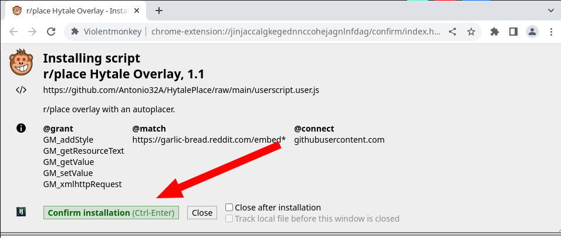

# HytalePlace
Userscript that previews an overlay over the r/Place canvas. Comes with an optional autoplace feature.

**Credits to r/osuplace and r/httyd for the v0 script.**

### Extension
- [Chrome/Opera](https://chrome.google.com/webstore/detail/violentmonkey/jinjaccalgkegednnccohejagnlnfdag)
- [Firefox](https://addons.mozilla.org/en-US/firefox/addon/violentmonkey/)

## Installation
- Install the extension for your browser.
- [Install the userscript](https://github.com/Antonio32A/HytalePlace/raw/main/userscript.user.js)

## Usage
- After installing visit r/Place and you will see the overlay.
- To toggle autoplace, press P on your keyboard.

## Autoplace
Autoplace will place pixels for you. To activate it press P on your keyboard.

**WARNING**: Autoplace is use at your own risk. It attempts to mimic human behavior but I do not guarantee that you will not get rate-limited. 
(As far as I know reddit will not fully ban your account and will just force you to wait a long long time before placing)

## To edit the overlay (Organisers only)
- Press `.` on your keyboard while logged in.
- Rename the file to `overlay.png` on your computer.
- Drag the file onto the `Explorer` tab.
- Click on `Replace`.
- Go to the `Source Control` tab.
- Type a message explaining the changes.
- Click on `Commit and Push` checkmark on the top.
